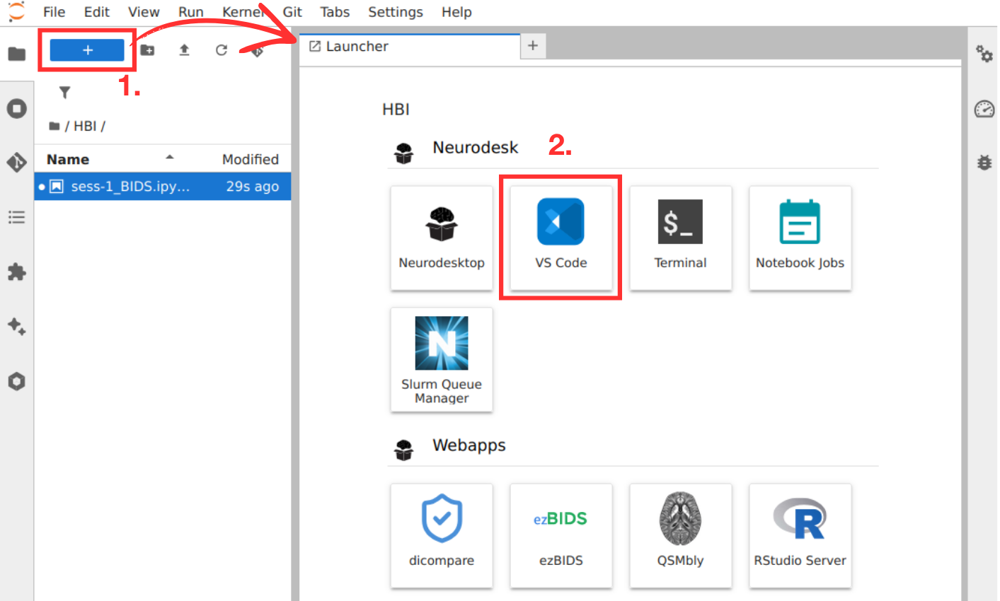
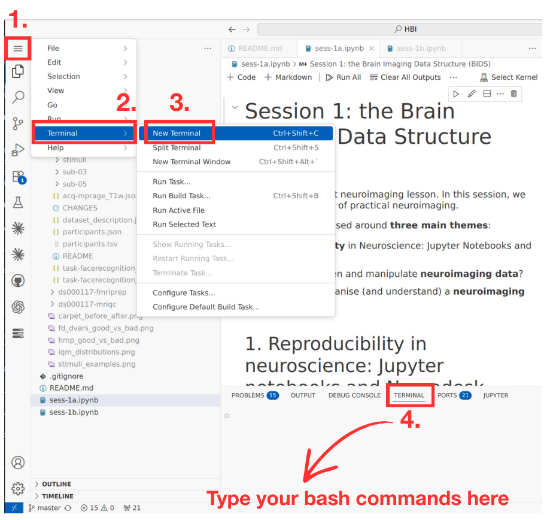
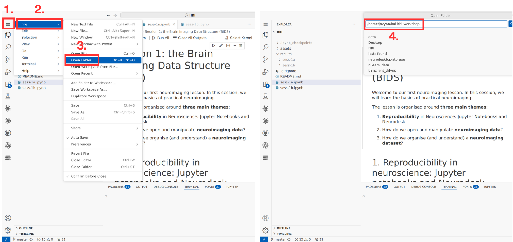

# KUL Human Brain Imaging practical classes (2026)

This repository hosts the Jupyter notebooks for the **Human Brain Imaging** practical classes at KU Leuven (2026 edition).

The notebooks are designed to run on [**Neurodesk**](https://www.neurodesk.org/), which provides all the neuroimaging software (MRIcron, dcm2niix, BIDScoin, MRIQC, fMRIPrep, nilearn, nibabel, …) pre-installed along with the shared course datasets. You can also run them outside Neurodesk, but in that case you will need to install the required software yourself and download the datasets manually — we do not support that path during class.

## Getting started with Neurodesk

1. Go to [play.neurodesk.org](https://play.neurodesk.org/).
2. Click **"Try Neurodesk in your browser"**.
3. Choose the **Europe** server.
4. Pick the **Medium** configuration (**8 CPU cores**).
5. Wait for the Neurodesk instance to start — you will land on a JupyterHub instance running in your browser.

## Setting up the repository inside Neurodesk

Once you are on the Neurodesk desktop:

1. Launch **VS Code** from inside the Neurodesk instance (it is available from the Launcher). 



2. Open a **terminal inside VS Code**: from the top menu, go to **Terminal → New Terminal** (or press `` Ctrl+` ``). A terminal panel will appear at the bottom of the VS Code window.



3. In that terminal, clone this repository into your home folder:

   ```bash
   cd ~
   git clone https://github.com/costantinoai/kul-hbi-workshop.git
   ```

4. Still in VS Code, go to **File → Open Folder…** and select the cloned repository folder (`~/kul-hbi-workshop`).



5. You are ready to go. Open `sess-1a.ipynb` to start the first session, then move on to `sess-1b.ipynb`, and so on.

## Course data

The course datasets (raw BIDS data, templates, atlases, and pre-computed derivatives such as MRIQC and fMRIPrep outputs) are pre-staged on the Neurodesk Europe server under:

```
/data/teaching/costantinoai/sess-xx
```

The notebooks reference this path directly, so everything will "just work" as long as you are on the Europe Neurodesk server. Outputs you generate during the practicals are written to `results/` inside the cloned repository.
